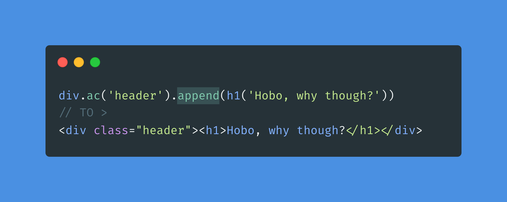

## Hobo.js



Welcome to Hobo. A little utility to generate html inside your js/ts code. Meant as a side-project, but after writing it I thought it might be useful to some people in some scenarios.


### Who's this for?

I have no idea! I might use it some time. But if you use it, and feel like letting me know, you can either leave a star, contribute or reach out! I would be interested in knowing how it's being used, if at all!

### What does it do?

Well, in essence it allows us to create html documents inside js or ts with ease. If I've not missed anything obvious, I think it's possible to generate any kind of html document. Or maybe other stuff like XML too 🤷🏻‍♂️

You can generate any tag you want. Add **classes**, **ids**, **styles**, and **attributes**. Create **css** and add **scripts**. All of this, with a quite simple api. I know it might look weird at first, but it's quite intuitive when you gget the hang (_it's quite fast, api is quite small_). 

It even handles self closing tags (void elements) for you. So when creating a **img** tag, it will know it's self closing.

Additionally it's almost fully typed, not only the surface, but into most css property values! IDEs will help autocomplete a lot of stuff! And is extensively tested.

### Getting Started
Install package: 

```
npm install https://github.com/nombrekeff/hobo-js
```

Then you  can import the package. 

```ts
import { builders, generate } from 'hobo-js';
// Or
const { builders, generate } = require('hobo-js')
```

I recomend destructuring builders, for a cleaner code:

```ts
const { div, p, span, b, script, button, style, a, hr } = builders;
```

### Examples

Check out the [`examples`](/examples) folder for a variety of examples on how to use hobo.

You can check the an interactive demo [here](https://nombrekeff.github.io/hobo-interactive-demo/)

### Docs
You can find docs [here](https://nombrekeff.github.io/hobo-js/)

### Demo

Let me show you a little sample (_I explain everything in detail below_)

```ts
const myPage = doc('My Page Title');

myPage.head.append(
  style({
    '.wrapper': {
      background: 'black',
      display: 'flex',
      alignItems: 'center',
      justifyContent: 'center',
    },
  }, {/* more style objects */}),
);

div.attach.ac('wrapper').build(
  p("I'm a child of div.wrapper"),
  b.addStyle('color', 'aliceblue')('And so am I'),
  hr,
  a.addAttr('href', 'http://example.com').b('Click me'),
  button.id('button-id').b("I'm also a child"),
);

script.a(() => {
  const btn = document.querySelector('#button-id');
}, () => {/* more js */});

console.log(generate(myPage.doc));
```

The above snippet would output the following html:
```html
<html>
  <head>
    <title>My Page Title</title>
    <style>
      .wrapper {
        background: black;
        display: flex;
        align-items: center;
        justify-content: center;
      }
    </style>
  </head>
  <body>
    <div class="wrapper">
      <p>I'm a child of div.wrapper</p>
      <b style="color: aliceblue">And so am I</b>
      <hr />
      <a href="http://example.com">Click me</a><button id="button-id">I'm also a child</button>
    </div>
    <script>
      const btn = document.querySelector('#button-id');
    </script>
  </body>
</html>
```

#### Demo exlanation

```ts
const myPage = doc('My Page Title');
```

First of all we create an HTML Page, by calling `doc()`. This will create an HTML, head and body tags. And returns 3 tags, `doc`, `head` and `body`. You can pass in an optional `title`, and `attachMode` arguments (_look at the [Attaching](#attaching) section for more info_).

> It's not required to create a doc, you can start the document with any tag you want.
> It also "attaches" the `body` tag to the hobo context. This means that you can then automatically add tags to the attached tag without having to use `.append`. I will explain further down.
> * `doc(mode)`, doc can receive a argument to change the Attach behaviour. You can specify if you want to attach to the body, head or html tags. It will attach to the body by default

----

```ts
myPage.head.append(
  style({
    '.wrapper': {
      background: 'black',
      display: 'flex',
      alignItems: 'center',
      justifyContent: 'center',
    },
  }, {
    'div': {...}
  }),
);
```

The following adds a style tag to the `head` tag. The style tag accepts objects with css definitions. It's typed, so intelisense will work.

> Note that in this case we use `.append` as the head is not attached.

----

```ts
div.a.ac('wrapper').build(
  p("I'm a child of div.wrapper"),
  b.addStyle('color', 'aliceblue')('And so am I'),
  hr,
  a.addAttr('href', 'http://example.com').b('Click me'),
  button.id('button-id').b("I'm also a child"),
);
```

In the step above step, we create the html that will be inside the `body`. As you can see instead of calling `.append` in the body tag like with the style.
`.a` and `.attach` are used to [attach](#attaching) to the current hobo context's attached tag (_which will be the body tag in the example_)

Then we set the tag's class name by calling `.ac` (you can also use `.addClass()`), this will set the class wrapper to the div (`<div class="wrapper"></div>`)

After that we build the tag by calling `.b` (or `.build()`, or you can also just call the builder `div()`), and pass in a list of children.

Hobo uses the builder pattern to ease the creation of tags. A tag can be built by, either calling the builder directly:
```ts
p("I'm a child of div.wrapper");
```
or by calling the `.b` method:
```ts
b.build('And so am I'),
```

> NOTE that it's not required to build the tag if you don't need to pass children to it:
> ```ts 
> div(
>   hr,
>   div.addClass('white-box'), 
> )
> ```

> **NOTE** each time you modify the builder it returns a new TagBuilder instance. 
> So you can't assign it and then modify, you need to chain. 
> This is done so hobo can generate new tag builders for each tag without needing to be a function.
> 
> This does not work:
> ```ts 
> const tag = div.ac('cl'); // .ac is shorthand for addClass
> tag.append(p()); // Will not affect `tag`
> ```

> Instead use chaining:
> ```ts 
> const tag = div.ac('cl').append(p());
> ```

You can set any attribute by using `.aa`, or `.am`:
```ts
a.addAttr('href', 'http://example.com');
a.aa('href', 'http://example.com');
a.setAttr({ 'href': 'http://example.com' });
a.sa({ 'href': 'http://example.com' });
```

----

```ts
p.addStyle('color', 'aliceblue');
p.as('color', 'aliceblue');
p.setStyle({ 'color': 'aliceblue' });
p.ss({ 'color': 'aliceblue' });
```
Tags can also have inline styles. You can add a single style by using the add style (`.as`) method, or add multiple at once by using the set styles (`.ss`) method.

----

```ts
script.a(() => {
  const btn = document.querySelector('#button-id');
}, () => {
  // More JS
});
```

Creates a `script` tag. Anything inside the function will be inserted into the generated script.  
The script acceptes a list of functions. You will also have complete typing for dom.

----

```ts
console.log(generate(myPage.doc));
```

Finally generate the html. `generate` returns a string. It's up to you to handle it from here. 

> NOTE that generate must receive the root tag you want to generate. 
> In this example wi pass in `myPage.doc` do we generate the whole page.
>
> But you can generate any tag you want:
> ```ts
> generate(div(p('Hello'), p('world')));
> ```


### Attaching

by calling `attach` on a tag, it makes it so that you don't need to manually add children to a tag:

```ts
const root = div.build("I'm the root tag");

attach(root);
div.a;
div.attach;
p.attach;
```

> Any tag that calls `.a` or `.attach` will be added as children of the root div.

You can also attach multiple times:
```ts
const root = div.build("I'm the root tag");

attach(root);
div.a;
const child = div.attach.addClass('child-wrapper');

attach(child);
p.a("I'm a child of child-wrapper");
p.a("And so am I");
detach();

p.a("I'm now a child of root div again");
detach();

p.a("I'm now not attached as there are no attached tags");
```

By calling attach the last tag is attached to, then by calling detach, the previously attached tag is now attached. Note that if you call attach and there's only 1 tag attached, it will detach that also. So consequent tags that try to attach will not attach as there's no tag attached.

When calling `doc()`, it will automatically attach to the body. Although you can specify the tag you want to attach to by passing the attachMode argument.
